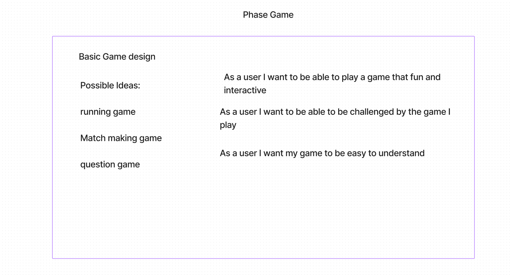

# LAB - 41

Intro to phaser. Building a game using phaser for learning something new. 

Author: Jonathan Brooks

[Pull Request](https://github.com/jonbrooks01/phaser-game/pulls)

<!-- [Server Repo](https://github.com/jonbrooks01/todoServer-) -->
<!-- 
[deployed server](https://storefront-u0jl.onrender.com/) -->

## Setup

.env requirements: NA

PORT - 5173

## Running the app

 <!-- npm run dev -->

<!-- Endpoint: Returns Object -->

<!-- {
  "domain": "deployment-practice-main.onrender.com/",
  "status": "{name: name}",
 "port":
} -->
Tests
Unit Tests: npm run test
<!-- Lint Tests: npm run lint -->

## UML

