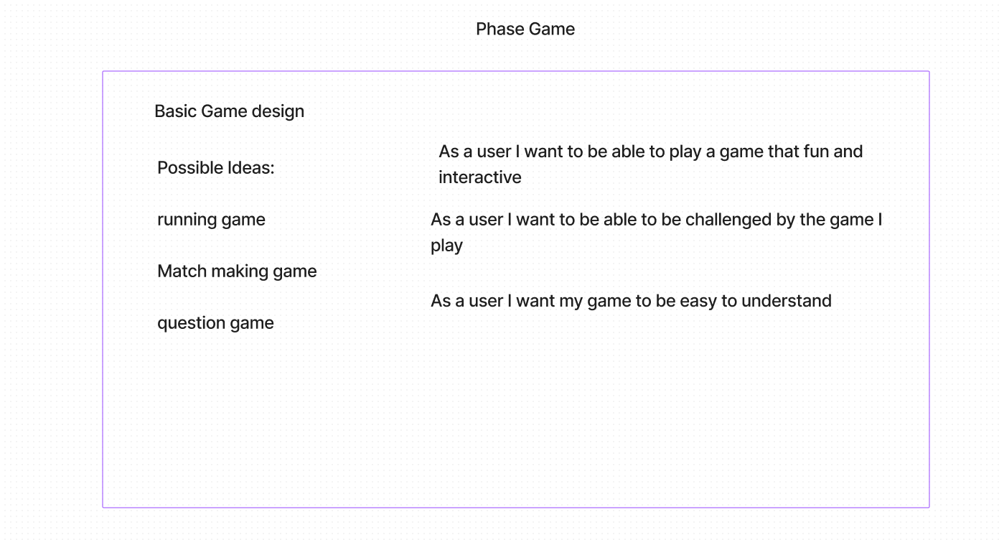

# LAB - 41

Intro to phaser. Building a game using phaser for learning something new. Learning how to build a game using the Phaser Library. 

Author: Jonathan Brooks

[PhaserReadme](./PhaserREADME.md)

[Pull Request](https://github.com/jonbrooks01/phaser-game/pulls)

<!-- [Server Repo](https://github.com/jonbrooks01/todoServer-) -->
<!-- 
[deployed server](https://storefront-u0jl.onrender.com/) -->

## Setup

download [MAMP](https://www.mamp.info/de/downloads/) in order to run the server locally on your machine in the document root select the root file as the starting point. When you hit start, the server will automatically open a browser with the game. Have Fun!

## Running the app

When you hit start, the server will automatically open a browser with the game. Have Fun!
 <!-- npm run dev -->

<!-- Endpoint: Returns Object -->

<!-- {
  "domain": "deployment-practice-main.onrender.com/",
  "status": "{name: name}",
 "port":
} -->
<!-- Tests
Unit Tests: npm run test -->
<!-- Lint Tests: npm run lint -->

## UML

## ScreenShot of Game

